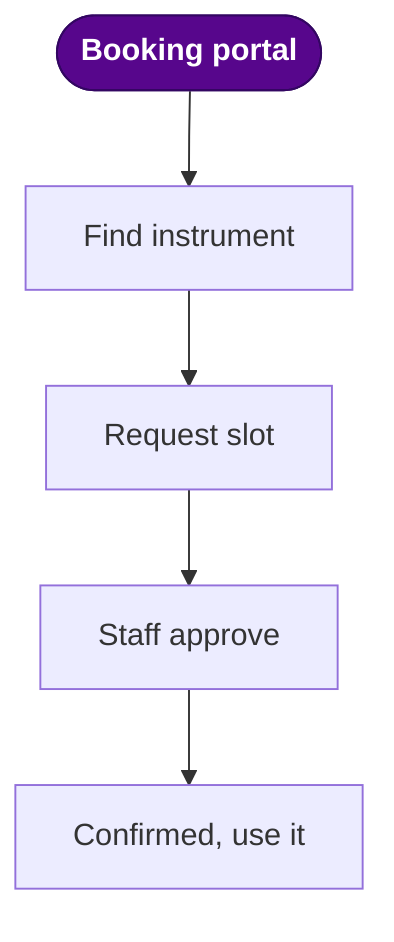
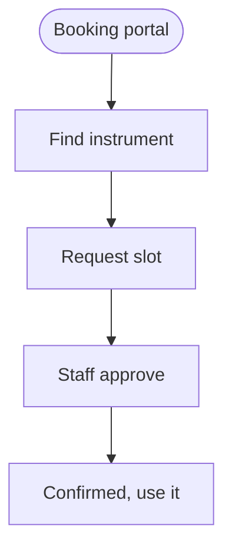

# AI-Assisted Presentations with Slidev

::eyebrow::
<span class="ctp-tag ctp-tag--accent">Workshop 01 · From Prompt to Polished Deck</span>

::meta::
Core Technology Platforms · NYU Abu Dhabi
12 May 2026

<!--
Welcome people in. Mention the deck they're watching is itself a Slidev deck, so
everything you see is achievable with the tools we'll teach in the next hour.
-->


---
layout: default
---

# What you'll leave with

<div class="agenda">
  <section class="ag-card ag-card--watch">
    <div class="ag-head">
      <span class="ag-eyebrow">Part A</span>
      <div class="ag-title">Watch</div>
      <p class="ag-lede">A tour of the AI tools that help build a deck.</p>
    </div>
    <ul class="ag-list">
      <li>The AI tool landscape</li>
      <li>From chat to a brief</li>
      <li>Visual, in-app, agentic</li>
      <li>Where the source lives</li>
    </ul>
    <div class="ag-foot"><span class="ag-chip">~20 min</span></div>
  </section>

  <div class="ag-arrow">&rarr;</div>

  <section class="ag-card ag-card--build">
    <div class="ag-head">
      <span class="ag-eyebrow">Part B</span>
      <div class="ag-title">Build</div>
      <p class="ag-lede">A polished CTP deck, live with Codex.</p>
    </div>
    <ul class="ag-list">
      <li>Slidev from zero</li>
      <li>Authoring in Markdown</li>
      <li>The CTP theme</li>
      <li>Export and publish</li>
    </ul>
    <div class="ag-foot"><span class="ag-chip ag-chip--solid">~40 min &middot; hands-on</span></div>
  </section>
</div>

<style scoped>
.agenda { display:flex; align-items:stretch; flex:1 1 auto; min-height:0; margin:16px 0 4px; }
.ag-card { flex:1; display:flex; flex-direction:column; border:1px solid var(--hairline); border-radius:var(--r-2); padding:24px 30px; }
.ag-card--watch { background:var(--violet-050); border-color:var(--violet-100); }
.ag-card--build { background:var(--white); }
.ag-eyebrow { font-family:var(--font-sans); font-size:var(--t-eyebrow); font-weight:600; text-transform:uppercase; letter-spacing:var(--tracked); color:var(--nyu-violet); }
.ag-title { font-family:var(--font-serif); font-size:40px; font-weight:700; line-height:var(--lh-tight); color:var(--fg1); margin-top:4px; }
.ag-lede { font-family:var(--font-serif); font-size:var(--t-body-lg); color:var(--fg2); margin-top:10px; max-width:26ch; }
.ag-list { list-style:none; padding:0; margin:18px 0 0; }
.ag-list li { position:relative; padding-left:22px; font-size:17px; color:var(--fg1); line-height:1.85; }
.ag-list li::before { content:""; position:absolute; left:0; top:0.72em; width:8px; height:8px; background:var(--nyu-violet); }
.ag-foot { margin-top:auto; padding-top:16px; }
.ag-chip { display:inline-block; font-family:var(--font-sans); font-size:var(--t-caption); font-weight:600; letter-spacing:var(--tracked-sm); text-transform:uppercase; padding:0.3em 0.85em; border-radius:var(--r-pill); border:1px solid var(--nyu-violet); color:var(--nyu-violet); }
.ag-chip--solid { background:var(--nyu-violet); color:var(--white); border-color:var(--nyu-violet); }
.ag-arrow { display:flex; align-items:center; padding:0 20px; color:var(--violet-300); font-size:34px; flex:none; }
</style>

<!--
First content slide, so make it land: Part A you watch, Part B you build, and A leads into
B. Point at the two words "Watch" and "Build" rather than reading the lists.
-->

---
layout: section
---

::number::
PART A

# From Prompt

::subtitle::
A quick tour of the AI tools that help build a deck.

<!--
Big chapter divider. Frame it: a ~20-minute map, not a tool catalog and not a follow-along.
Laptops stay closed until Part B. The throughline is where the source of truth lives.
-->

---
layout: default
---

# The work comes before the tool

<div class="flow">
  <div class="flow__step">
    <div class="flow__k">Source</div>
    <div class="flow__v">Papers, notes, data, an old deck</div>
  </div>
  <div class="flow__arrow">&rarr;</div>
  <div class="flow__step">
    <div class="flow__k">Thinking</div>
    <div class="flow__v">Audience, structure, the claims that matter</div>
  </div>
  <div class="flow__arrow">&rarr;</div>
  <div class="flow__step flow__step--last">
    <div class="flow__k">Tool</div>
    <div class="flow__v">Chosen last, once the thinking holds</div>
  </div>
</div>

<p class="lede">Pick the tool last. Everything before it is portable.</p>

<style scoped>
.flow { display:flex; align-items:stretch; gap:16px; margin-top:48px; }
.flow__step { flex:1; border:1px solid var(--hairline); border-radius:var(--r-2); padding:22px 24px; }
.flow__step--last { border-color:var(--nyu-violet); }
.flow__k { font-family:var(--font-sans); font-weight:700; text-transform:uppercase; letter-spacing:var(--tracked-sm); font-size:13px; color:var(--nyu-violet); margin-bottom:10px; }
.flow__v { font-size:15px; color:var(--fg2); line-height:var(--lh-snug); }
.flow__arrow { display:flex; align-items:center; color:var(--ink-300); font-size:26px; }
.lede { margin-top:40px; font-family:var(--font-serif); font-size:var(--t-body-lg); color:var(--fg1); }
</style>

<!--
Slow the "AI makes slides" instinct. The first decision is where the structure of the
talk lives, not which app to open. Keep it fast; it sets up the ladder next.
-->

---
layout: default
---

# Four ways AI can touch your deck

<div class="rung-cap">Reaches deeper into the deck &rarr;</div>

<div class="ladder">
  <div class="rung">
    <div class="rung__n">1</div>
    <div class="rung__b"><div class="rung__t">Chat</div><div class="rung__d">Draft the structure and a portable brief</div></div>
    <div class="rung__bar"><span style="width:25%"></span></div>
  </div>
  <div class="rung">
    <div class="rung__n">2</div>
    <div class="rung__b"><div class="rung__t">Visual generators</div><div class="rung__d">Designed slides from a prompt</div></div>
    <div class="rung__bar"><span style="width:50%"></span></div>
  </div>
  <div class="rung">
    <div class="rung__n">3</div>
    <div class="rung__b"><div class="rung__t">In-app copilots</div><div class="rung__d">Help inside the slide app you already use</div></div>
    <div class="rung__bar"><span style="width:75%"></span></div>
  </div>
  <div class="rung">
    <div class="rung__n">4</div>
    <div class="rung__b"><div class="rung__t">Agentic</div><div class="rung__d">Edits the deck&rsquo;s source files directly</div></div>
    <div class="rung__bar"><span style="width:100%"></span></div>
  </div>
</div>

<style scoped>
.rung-cap { font-family:var(--font-sans); font-size:12px; font-weight:600; text-transform:uppercase; letter-spacing:var(--tracked-sm); color:var(--ink-400); text-align:right; margin-bottom:10px; }
.ladder { display:flex; flex-direction:column; gap:12px; }
.rung { display:flex; align-items:center; gap:22px; border:1px solid var(--hairline); border-radius:var(--r-2); padding:14px 20px; }
.rung__n { font-family:var(--font-serif); font-weight:700; font-size:30px; color:var(--nyu-violet); width:30px; text-align:center; flex:none; }
.rung__b { flex:1; }
.rung__t { font-weight:600; font-size:18px; color:var(--fg1); }
.rung__d { font-size:14px; color:var(--fg2); }
.rung__bar { width:120px; height:6px; background:var(--ink-100); border-radius:var(--r-pill); flex:none; overflow:hidden; }
.rung__bar span { display:block; height:100%; background:var(--nyu-violet); border-radius:var(--r-pill); }
</style>

<!--
The backbone of Part A. Each level after this is a quick visual stop, mostly shown live
in the actual tool. The bars encode the order: how deeply the AI reaches into the deck.
-->

---
layout: default
---

# Level 1 &middot; Chat

<span class="ctp-eyebrow">Raw material &rarr; a portable brief</span>

Paste source material into ChatGPT, Claude, or Gemini and ask for a structured Markdown brief. Running this live:

```text
Turn the source material below into a Markdown presentation brief.

Audience: NYUAD researchers and staff new to the Core Technology Platforms.
Goal: they understand what the platforms offer and how to start a project with one.
Length: 6-8 slides, about 10 minutes.
Tone: clear, technical, no hype, no emoji.

Return Markdown with: title, audience, learning objectives,
one H2 heading per slide, 2-4 bullets per slide, speaker notes,
and a short list of facts to verify before presenting.

Source material:
PASTE NOTES, ABSTRACT, WEBSITE TEXT, OR A PAPER EXCERPT HERE
```

<!--
Run this live in ChatGPT on the org account. The copy button on the code block makes it
easy to grab. The output is a Markdown brief, which the next slide unpacks.
-->

---
layout: two-cols-header
---

# The brief is just Markdown

::left::

<div style="display:inline-block;font-family:var(--font-mono);font-size:13px;color:var(--fg2);background:var(--bg2);border:1px solid var(--hairline);border-bottom:0;border-radius:2px 2px 0 0;padding:5px 12px;margin-bottom:-2px;">presentation-brief.md</div>

```md
# Orientation to the CTP
audience: new researchers
goal: start a project with a platform

## What the platforms are
- shared instruments + expert staff

## When to reach out
- early, before you collect data

<!-- speaker note: open with the why -->
```

::right::

<p style="font-family:var(--font-serif);font-size:var(--t-body-lg);color:var(--fg2);margin:0 0 18px;">One plain-text file. Every tool downstream can read it.</p>

<ul style="list-style:none;padding:0;margin:0;">
  <li style="display:flex;align-items:flex-start;gap:12px;margin:0 0 13px;font-size:17px;line-height:1.5;color:var(--fg1);"><span style="flex:none;width:8px;height:8px;margin-top:7px;background:var(--nyu-violet);"></span><span><strong style="color:var(--nyu-violet);font-weight:700;">Readable</strong>: humans scan it at a glance</span></li>
  <li style="display:flex;align-items:flex-start;gap:12px;margin:0 0 13px;font-size:17px;line-height:1.5;color:var(--fg1);"><span style="flex:none;width:8px;height:8px;margin-top:7px;background:var(--nyu-violet);"></span><span><strong style="color:var(--nyu-violet);font-weight:700;">Editable</strong>: AI rewrites it precisely</span></li>
  <li style="display:flex;align-items:flex-start;gap:12px;margin:0 0 13px;font-size:17px;line-height:1.5;color:var(--fg1);"><span style="flex:none;width:8px;height:8px;margin-top:7px;background:var(--nyu-violet);"></span><span><strong style="color:var(--nyu-violet);font-weight:700;">Portable</strong>: feeds Slidev, PowerPoint, PDF, Claude</span></li>
  <li style="display:flex;align-items:flex-start;gap:12px;margin:0 0 13px;font-size:17px;line-height:1.5;color:var(--fg1);"><span style="flex:none;width:8px;height:8px;margin-top:7px;background:var(--nyu-violet);"></span><span><strong style="color:var(--nyu-violet);font-weight:700;">Versionable</strong>: diff and track it like code</span></li>
</ul>

<!--
This is why Markdown shows up now, not earlier: the brief from Level 1 is plain text you
can read, version, and hand to any tool. It is the through-line for the rest of Part A.
-->

---
layout: two-cols-header
---

# Level 2 &middot; Visual generators

::left::

<div style="display:flex; align-items:center; justify-content:center; height:100%;">
  
</div>

::right::

<ul style="list-style:none;padding:0;margin:0;">
  <li style="display:flex;align-items:flex-start;gap:12px;margin:0 0 13px;font-size:18px;line-height:1.5;color:var(--fg1);"><span style="flex:none;width:8px;height:8px;margin-top:8px;background:var(--nyu-violet);"></span><span>Prompt in, designed deck out</span></li>
  <li style="display:flex;align-items:flex-start;gap:12px;margin:0 0 13px;font-size:18px;line-height:1.5;color:var(--fg1);"><span style="flex:none;width:8px;height:8px;margin-top:8px;background:var(--nyu-violet);"></span><span>Refine it by chatting</span></li>
  <li style="display:flex;align-items:flex-start;gap:12px;margin:0 0 13px;font-size:18px;line-height:1.5;color:var(--fg1);"><span style="flex:none;width:8px;height:8px;margin-top:8px;background:var(--nyu-violet);"></span><span>A real, editable artifact</span></li>
  <li style="display:flex;align-items:flex-start;gap:12px;margin:0 0 13px;font-size:18px;line-height:1.5;color:var(--fg1);"><span style="flex:none;width:8px;height:8px;margin-top:8px;background:var(--nyu-violet);"></span><span>Export or keep iterating</span></li>
</ul>

<CtpCallout label="Live demo" tone="violet">
Into Claude Design now. Gamma and Canva do similar things.
</CtpCallout>

<!--
Switch to Claude Design: show a prompt, the generated deck, and one iteration by asking
for a change. Name Gamma/Canva once; the concept is what matters, not a tour.
-->

---
layout: two-cols-header
---

# Level 3 &middot; Copilots in the app

::left::

<div style="display:flex; align-items:center; justify-content:center; height:100%;">
  
</div>

::right::

<ul style="list-style:none;padding:0;margin:0;">
  <li style="display:flex;align-items:flex-start;gap:12px;margin:0 0 13px;font-size:18px;line-height:1.5;color:var(--fg1);"><span style="flex:none;width:8px;height:8px;margin-top:8px;background:var(--nyu-violet);"></span><span>Lives inside PowerPoint / Slides</span></li>
  <li style="display:flex;align-items:flex-start;gap:12px;margin:0 0 13px;font-size:18px;line-height:1.5;color:var(--fg1);"><span style="flex:none;width:8px;height:8px;margin-top:8px;background:var(--nyu-violet);"></span><span>Stays in your required template</span></li>
  <li style="display:flex;align-items:flex-start;gap:12px;margin:0 0 13px;font-size:18px;line-height:1.5;color:var(--fg1);"><span style="flex:none;width:8px;height:8px;margin-top:8px;background:var(--nyu-violet);"></span><span>Best for last-mile polish</span></li>
  <li style="display:flex;align-items:flex-start;gap:12px;margin:0 0 13px;font-size:18px;line-height:1.5;color:var(--fg1);"><span style="flex:none;width:8px;height:8px;margin-top:8px;background:var(--nyu-violet);"></span><span>No new tool to learn</span></li>
</ul>

<CtpCallout label="Live demo" tone="violet">
Into PowerPoint with the Claude plugin.
</CtpCallout>

<!--
Switch to PowerPoint and use the Claude plugin live. The point: help inside an existing
deck or a mandated template, where the file itself is the constraint.
-->

---
layout: two-cols-header
---

# Level 4 &middot; Agentic

::left::

<div style="display:flex; align-items:center; justify-content:center; height:100%;">
  
</div>

::right::

<ul style="list-style:none;padding:0;margin:0;">
  <li style="display:flex;align-items:flex-start;gap:12px;margin:0 0 13px;font-size:18px;line-height:1.5;color:var(--fg1);"><span style="flex:none;width:8px;height:8px;margin-top:8px;background:var(--nyu-violet);"></span><span>Edits your source files directly</span></li>
  <li style="display:flex;align-items:flex-start;gap:12px;margin:0 0 13px;font-size:18px;line-height:1.5;color:var(--fg1);"><span style="flex:none;width:8px;height:8px;margin-top:8px;background:var(--nyu-violet);"></span><span>Runs the preview, iterates with you</span></li>
  <li style="display:flex;align-items:flex-start;gap:12px;margin:0 0 13px;font-size:18px;line-height:1.5;color:var(--fg1);"><span style="flex:none;width:8px;height:8px;margin-top:8px;background:var(--nyu-violet);"></span><span>Changes structure, not just pixels</span></li>
  <li style="display:flex;align-items:flex-start;gap:12px;margin:0 0 13px;font-size:18px;line-height:1.5;color:var(--fg1);"><span style="flex:none;width:8px;height:8px;margin-top:8px;background:var(--nyu-violet);"></span><span>Works because the deck is text</span></li>
</ul>

<CtpCallout label="That is Part B" tone="accent">
We do this live with Codex and Slidev next.
</CtpCallout>

<!--
Don't demo here, just name it and point forward. This whole level is Part B, performed
live right after this.
-->

---
layout: default
---

# One source, many outputs

<div class="hub-wrap">
<svg class="hub-svg" viewBox="0 0 920 340" style="width:100%; max-height:332px; height:auto; display:block; margin:0 auto;">
  <path class="line" style="animation-delay:0.30s" d="M280,170 C 470,170 470,35 615,35"/>
  <path class="line" style="animation-delay:0.48s" d="M280,170 C 470,170 470,89 615,89"/>
  <path class="line" style="animation-delay:0.66s" d="M280,170 C 470,170 470,143 615,143"/>
  <path class="line" style="animation-delay:0.84s" d="M280,170 C 470,170 470,197 615,197"/>
  <path class="line" style="animation-delay:1.02s" d="M280,170 C 470,170 470,251 615,251"/>
  <path class="line" style="animation-delay:1.20s" d="M280,170 C 470,170 470,305 615,305"/>
  <g class="src" style="animation-delay:0.10s"><rect class="src-box" x="30" y="130" width="250" height="80" rx="4"/><text class="src-t1" x="155" y="166" text-anchor="middle">presentation-brief.md</text><text class="src-t2" x="155" y="190" text-anchor="middle">THE SOURCE OF TRUTH</text></g>
  <g class="out" style="animation-delay:0.72s"><rect class="out-box" x="615" y="15" width="275" height="40" rx="4"/><text class="out-t" x="634" y="36" dominant-baseline="middle">Slidev deck</text></g>
  <g class="out" style="animation-delay:0.90s"><rect class="out-box" x="615" y="69" width="275" height="40" rx="4"/><text class="out-t" x="634" y="90" dominant-baseline="middle">PDF / web</text></g>
  <g class="out" style="animation-delay:1.08s"><rect class="out-box" x="615" y="123" width="275" height="40" rx="4"/><text class="out-t" x="634" y="144" dominant-baseline="middle">PowerPoint</text></g>
  <g class="out" style="animation-delay:1.26s"><rect class="out-box" x="615" y="177" width="275" height="40" rx="4"/><text class="out-t" x="634" y="198" dominant-baseline="middle">Claude Design</text></g>
  <g class="out" style="animation-delay:1.44s"><rect class="out-box" x="615" y="231" width="275" height="40" rx="4"/><text class="out-t" x="634" y="252" dominant-baseline="middle">LaTeX / Beamer</text></g>
  <g class="out" style="animation-delay:1.62s"><rect class="out-box" x="615" y="285" width="275" height="40" rx="4"/><text class="out-t" x="634" y="306" dominant-baseline="middle">Another AI pass</text></g>
</svg>
</div>

<p class="hub__note">Keep edits flowing back to the text. Any tool, including the agent in Part B, picks up from there.</p>

<style scoped>
.hub-wrap { margin-top: 6px; }
.hub__note { margin-top: 16px; text-align:center; font-family:var(--font-serif); font-size:var(--t-body-lg); color:var(--fg1); }

.src-box { fill: var(--nyu-violet); }
.src-t1 { fill: var(--white); font-family: var(--font-mono); font-size: 17px; }
.src-t2 { fill: var(--violet-100); font-family: var(--font-sans); font-size: 10px; letter-spacing: 0.14em; }

.out-box { fill: var(--white); stroke: var(--ink-200); stroke-width: 1; }
.out-t   { fill: var(--ink-900); font-family: var(--font-sans); font-size: 15px; }

.line { fill: none; stroke: var(--violet-300); stroke-width: 2; stroke-dasharray: 560; stroke-dashoffset: 560; animation: hubDraw 0.6s ease forwards; }
.src  { opacity: 0; animation: hubFade 0.5s ease forwards; }
.out  { opacity: 0; animation: hubSlide 0.5s ease forwards; }

@keyframes hubDraw  { to { stroke-dashoffset: 0; } }
@keyframes hubFade  { to { opacity: 1; } }
@keyframes hubSlide { from { opacity: 0; transform: translateX(-10px); } to { opacity: 1; transform: translateX(0); } }
</style>

<!--
The payoff and the close of Part A. Whatever tool you used, the durable thing is the text
you can review, version, reuse, and hand to the next AI. Then move into Part B.
-->

---
layout: section
---

::number::
PART B

# To Polished Deck

::subtitle::
From portable Markdown source to a published Slidev presentation.

<!--
Big-chapter divider. Part A gave the 20-minute workflow map. Part B is the
hands-on implementation: turn the source-of-truth idea into a running Slidev deck.
-->

---

# What is Slidev?

A presentation tool where:

- **Slides are Markdown.** One `slides.md` file holds your whole deck.
- **Components are Vue.** Drop in interactive widgets, animations, charts.
- **Everything is the web.** Built on Vite, runs in any browser, exports to PDF or static HTML.
- **It's open source.** [sli.dev](https://sli.dev) · [github.com/slidevjs/slidev](https://github.com/slidevjs/slidev)

```md
# A slide

Just a markdown heading and some content.

- Bullet
- Another bullet
```

---

# Making a simple slides.md file

The minimum a Slidev deck needs is a single Markdown file `slides.md`, minimal example below:

````md
# Deck Test

Use markdown syntax here to add content

- item 1
- item 2
- etc...

<!--
Speaker notes here
-->

---

# the title for slide 1

Some text

<!--
Notes for slide 2
-->
````


---
layout: two-cols-header
---

# Running the deck

`cd` into the folder where `slides.md` lives, install Slidev locally (pinned to `^0.49.0` because v52 has a Windows path bug), and start the dev server. Open `http://localhost:3030/` when it prints.

::left::

### Windows (PowerShell)

**No Node yet?** Download LTS from [nodejs.org](https://nodejs.org), or:

```powershell
winget install OpenJS.NodeJS.LTS
```

Then in a **fresh** PowerShell window:

```powershell
cd C:\path\to\your\deck
npm init -y
npm install --save-dev "@slidev/cli@^0.49.0"
npx slidev
```

::right::

### macOS / Linux (Terminal)

**No Node yet?** Download LTS from [nodejs.org](https://nodejs.org), or:

```bash
brew install node           # macOS
sudo apt install nodejs npm # Debian / Ubuntu
```

Then in your deck folder:

```bash
cd /path/to/your/deck
npm init -y
npm install --save-dev "@slidev/cli@^0.49.0"
npx slidev
```

---
layout: two-cols-header
---

# Start your own deck with CTP template:

After the manual setup above works once, the **CTP templates repo** ships a scaffold script so you never repeat those steps. Clone [`ctp-templates`](https://github.com/NYUAD-Core-Technology-Platforms/ctp-templates) once as a sibling of where you keep code, then:

::left::

### Scaffold

```bash
cd ctp-templates
pnpm install         # one-time
pnpm new-deck my-talk
```

It creates `../my-talk/` next door to `/ctp-templates/`

::right::

### What you get
A ready-to-edit deck next door at `../my-talk/`:
- `slides.md`, your content
- the CTP theme and components, already wired
- `public/` for images

Now run it (next slide).


---

# Run your new deck

From the folder the scaffold just created, install once and start the live dev server. Open `http://localhost:3030/` when it prints.

```bash
cd ../my-talk
npm install        # first time only
npx slidev         # live preview at http://localhost:3030
```

<CtpCallout label="The editing loop" tone="accent">
Edit `slides.md` and the browser hot-reloads instantly. The deck already uses the CTP theme and components, so it looks like this one from the first run, no extra setup.
</CtpCallout>

<!--
The "now run it" payoff after scaffolding. Stress the loop: edit Markdown, see it
live. The CTP theme is already wired (theme: ctp in the frontmatter). If port 3030
is busy, Slidev picks the next free port. Mirrors the earlier "Running the deck"
slide, but here it's the scaffolded deck specifically.
-->

---
layout: two-cols-header
---

# One file, every agent: AGENTS.md

::left::

<div style="display:inline-block;font-family:var(--font-mono);font-size:13px;color:var(--fg2);background:var(--bg2);border:1px solid var(--hairline);border-bottom:0;border-radius:2px 2px 0 0;padding:5px 12px;margin-bottom:-2px;">AGENTS.md</div>

```md
# AGENTS.md

## What this repo is
Slidev decks for the CTP workshop series.

## Hard rules
- Never edit the theme from this repo.
- No em dashes in generated content.

## Commands
pnpm install
pnpm dev:01
```

::right::

<p style="font-family:var(--font-serif);font-size:var(--t-body-lg);color:var(--fg2);margin:0 0 18px;">A README for AI agents. Independent of the tool you use.</p>

<ul style="list-style:none;padding:0;margin:0;">
  <li style="display:flex;align-items:flex-start;gap:12px;margin:0 0 13px;font-size:18px;line-height:1.5;color:var(--fg1);"><span style="flex:none;width:8px;height:8px;margin-top:8px;background:var(--nyu-violet);"></span><span>Codex, Cursor, Copilot, Aider all read it</span></li>
  <li style="display:flex;align-items:flex-start;gap:12px;margin:0 0 13px;font-size:18px;line-height:1.5;color:var(--fg1);"><span style="flex:none;width:8px;height:8px;margin-top:8px;background:var(--nyu-violet);"></span><span>Conventions, commands, and guardrails in one place</span></li>
  <li style="display:flex;align-items:flex-start;gap:12px;margin:0 0 13px;font-size:18px;line-height:1.5;color:var(--fg1);"><span style="flex:none;width:8px;height:8px;margin-top:8px;background:var(--nyu-violet);"></span><span>Point your agent here first</span></li>
  <li style="display:flex;align-items:flex-start;gap:12px;margin:0 0 13px;font-size:18px;line-height:1.5;color:var(--fg1);"><span style="flex:none;width:8px;height:8px;margin-top:8px;background:var(--nyu-violet);"></span><span>Codex picks it up automatically in this repo</span></li>
</ul>

<!--
The "how do you steer the agent" beat. AGENTS.md is plain Markdown at the repo root that
any agent reads first, so the repo is independent of which tool you use. Point Codex at the
repo and it reads this automatically. Mention CLAUDE.md verbally: same idea, Claude Code's
own flavor; the open AGENTS.md works across all of them, so we keep just one.
-->

---
layout: two-cols-header
---

# Published automatically, online

All workshops decks will be hosted online. Push to `main` and a GitHub Action rebuilds every deck and republishes the site. The same build reruns when the CTP theme changes, so every deck stays current. No manual export, no uploading files.

::left::

### Live site and landing page
- The landing page lists every workshop and links to each deck.
- Each deck is live at `/<NN-slug>/`, with PDF and PowerPoint downloads beside it.

Live now:
- [Landing page](https://nyuad-core-technology-platforms.github.io/ctp-upscaling-workshop-series/)
- [Workshop 01](https://nyuad-core-technology-platforms.github.io/ctp-upscaling-workshop-series/01-slidev/)

::right::

### Versioned releases
Tag a version and a second workflow attaches per-deck archives to a GitHub Release:

```bash
git tag v2026.05 && git push origin v2026.05
```

- `<NN-slug>.pdf` and `<NN-slug>.pptx`, exported PDF and PowerPoint
- `<NN-slug>-html.zip`, an offline copy of the slides

<!--
Point at this live site as proof: the deck on screen is published exactly this
way. Two workflows do it: deploy-pages.yml (Pages site on every push) and
release.yml (versioned PDF + HTML archives on a tag), both via scripts/ci-build.mjs.
-->

---
layout: two-cols-header
---

# When the CTP template changes

Your deck links the theme via `file:../ctp-templates/slidev`, a **symlink** not a copy, so you never reinstall when it evolves.

::left::

### To get the latest theme

```bash
cd /path/to/ctp-templates
git pull
```

The next browser reload (or `npx slidev build` / `export`) picks up the changes.

::right::

### Where it applies
- **Locally:** `git pull` in [`ctp-templates`](https://github.com/NYUAD-Core-Technology-Platforms/ctp-templates), every deck reflects it.
- **Online:** a theme change triggers an automatic rebuild and republish.

<CtpCallout label="Check after a template change" tone="sand">
A theme update can break or shift a slide. Always page through your deck afterward to confirm it still looks great.
</CtpCallout>


---
layout: two-cols-header
---

# Why all this complexity?

Plain text plus a few workflows buy you things a binary slide file simply cannot.

::left::

### It's just syntax
Markdown is readable, reviewable, and portable. AI tools can edit it precisely, and it travels across formats (PDF, web, LaTeX).

### Version control
Git gives full history with push, pull, branches, and pull-request review. Roll back a bad change; collaborate without emailing files around.

::right::

### Automated testing
CI builds every deck on each push, flags one that fails to render, and republishes the site. No manual export, no stale copies.

### Interactive by design
Slidev slides are web pages: live charts, components, and animations. For research, display scientific data interactively instead of pasting static screenshots.

<!--
This is the payoff slide. Tie each advantage back to a pain it removes:
text = reviewable + AI-editable, git = history + collaboration, CI = always
publishable + verified, interactive = real data viz for scientific talks.
-->

---

# Live data: lab equipment from Booked

Pulled from **Booked** at build time; re-syncs online every Monday, or run `npm run data` locally (NYU VPN).

<EquipmentList />

<!--
The whole list is real data baked into equipment.json by scripts/fetch-equipment.mjs
(GET /Services/Resources/ with X-Booked-ApiId / X-Booked-ApiKey headers). Booked is
behind the NYU VPN, so the fetch runs on the self-hosted MEG Workstation runner
(sync-booked-data.yml) or locally via `npm run data`, then the names are committed.
No credentials ship in the published deck. Use the Prev/Next buttons to page through
~300 resources; mention the count to show the scale of the CTP facility.
-->

---

# CTP by the numbers

Real usage from **Booked**, recomputed at every build; re-syncs online every Monday, or run `npm run data:stats` locally (NYU VPN).

<StatCards />

<!--
KPI cards count up on load. Hours / reservations / researchers are aggregated
from /Reservations over the last 12 months (stats.json via fetch-stats.mjs);
catalog count is equipment.json. Aggregates only, no names or personal data.
Numbers shown may be sample data until the stats fetch runs on the VPN/runner.
-->

---

# Busiest instruments, by booked hours

<UsageBars />

Top 10 over the last 12 months. Re-syncs online every Monday, or run `npm run data:stats` locally (NYU VPN).

<!--
Same source as the KPI slide (stats.json, topByHours). Horizontal bars because
the instrument names are long. Point out the mix: microscopy, NMR, sequencing,
fabrication, a one-slide portrait of what the facility actually does.
-->

---

# The CTP facilities at NYU Abu Dhabi

<a class="ctp-site-card" href="https://nyuad.nyu.edu/en/research/facilities-and-support/core-technology-platforms.html" target="_blank" rel="noopener noreferrer">
  <span class="ctp-site-card__eyebrow">NYU Abu Dhabi · Research</span>
  <span class="ctp-site-card__title">Core Technology Platforms ↗</span>
  <span class="ctp-site-card__desc">Shared research facilities and instrumentation, the labs behind the live equipment list.</span>
  <span class="ctp-site-card__url">nyuad.nyu.edu/en/research/facilities-and-support/core-technology-platforms</span>
</a>

A slide is a web page, so it can embed live sites. This institutional page blocks framing (`X-Frame-Options`), so we link out; an embeddable target like a dashboard, the published deck, or a chart would render inline.

<style>
.ctp-site-card {
  display: block;
  margin: var(--s-5) 0 var(--s-5);
  padding: var(--s-6) var(--s-7);
  border: 1px solid var(--hairline);
  border-left: 4px solid var(--ctp-color-violet);
  border-radius: var(--r-3);
  background: var(--bg2);
  text-decoration: none;
  color: var(--fg1);
  box-shadow: var(--sh-1);
}
.ctp-site-card:hover { background: var(--bg3); }
.ctp-site-card__eyebrow {
  display: block;
  font-size: var(--t-eyebrow);
  letter-spacing: var(--tracked-sm);
  text-transform: uppercase;
  color: var(--ctp-color-violet);
  font-weight: 700;
}
.ctp-site-card__title {
  display: block;
  font-family: var(--font-serif);
  font-size: var(--t-h2);
  margin: var(--s-2) 0;
}
.ctp-site-card__desc {
  display: block;
  font-size: var(--t-body);
  color: var(--fg2);
}
.ctp-site-card__url {
  display: block;
  margin-top: var(--s-3);
  font-family: var(--font-mono);
  font-size: var(--t-small);
  color: var(--ctp-color-violet);
  word-break: break-all;
}
</style>

<!--
The CTP facilities page sends X-Frame-Options/CSP and refuses to be framed (a live
iframe just shows a broken-page icon), so we feature it as a branded link card.
The teaching point still holds: a slide is a web page and CAN embed sites that
allow it (dashboards, the published deck, Observable/Plotly charts); some
institutional sites opt out of framing. To show a true inline embed, point an
iframe at an embeddable URL instead.
-->


---
layout: two-cols-header
---

# Book an instrument: the CTPSS flow

::left::

A [Mermaid](https://mermaid.js.org) diagram, rendered straight from the Markdown. The violet **Booking portal** node is a live link to [corelabs.abudhabi.nyu.edu](https://corelabs.abudhabi.nyu.edu/).



::right::

### It is just text

No drawing app, no image to keep in sync. The whole chart is this block in `slides.md`; edit the text and the SVG re-renders on save:

````md

````

<!--
Mermaid ships with Slidev: a mermaid block becomes an SVG, versioned with the
slide. Showing the source next to the render is the point: input on the right,
output on the left, both from the same Markdown. The click directive on the portal
node opens corelabs.abudhabi.nyu.edu in a new tab (setup/mermaid.ts, securityLevel
'loose'). In PDF/PPTX exports the diagram is a static image, so say the URL out
loud. Walk the path: log in, find the instrument, request, approval, then use.
-->

---
layout: two-cols-header
---

# Complex math, typeset with LaTeX

Inline like $\nabla\cdot\mathbf{E} = \rho/\varepsilon_0$, or full display blocks, all rendered by KaTeX:

::left::

### Maxwell's equations
$$
\begin{aligned}
\nabla\cdot\mathbf{E} &= \frac{\rho}{\varepsilon_0} &
\nabla\cdot\mathbf{B} &= 0 \\[6pt]
\nabla\times\mathbf{E} &= -\frac{\partial \mathbf{B}}{\partial t} &
\nabla\times\mathbf{B} &= \mu_0\mathbf{J} + \mu_0\varepsilon_0\frac{\partial \mathbf{E}}{\partial t}
\end{aligned}
$$

::right::

### Spectroscopy and fits
$$ \hat{f}(\xi) = \int_{-\infty}^{\infty} f(x)\, e^{-2\pi i x \xi}\, dx $$

$$ \hat{\boldsymbol\beta} = (\mathbf{X}^{\top}\mathbf{X})^{-1}\mathbf{X}^{\top}\mathbf{y} $$

<!--
KaTeX renders math from plain TeX: inline with single $...$, display with $$...$$.
Left is an aligned multi-equation block (Maxwell); right pairs the Fourier
transform (the math behind NMR/IR spectroscopy here) with the ordinary
least-squares normal equations (the closed form behind the next slide's demo).
-->

---

# Interactive math: least-squares regression

Slides are web pages, so this stats demo is **live**: least squares fits points drawn from `y = slope·x + 2 + noise`. Change the parameters and watch the fit and **R²** update.

<LeastSquaresDemo />

<!--
Try it live: raise Noise sigma and watch R squared fall; grow the sample size and
the fitted slope settles closer to the true slope; hit Resample for a fresh draw
from the same parameters.

The point: this is real computation in the slide, not a screenshot. The OLS
slope/intercept are computed in JS (closed form) and R squared updates live.
A seeded RNG keeps the data fixed when you change one parameter, so each button
isolates one effect; Resample bumps the seed for a new draw. Component lives in
components/LeastSquaresDemo.vue. Tie back to the "interactive by design" slide.
-->

---
layout: end
---

# Thanks!

::meta::

Questions? Drop them in the CTP Upscaling channel.

Repo &nbsp;·&nbsp; [github.com/NYUAD-Core-Technology-Platforms/ctp-upscaling-workshop-series](https://github.com/NYUAD-Core-Technology-Platforms/ctp-upscaling-workshop-series)
